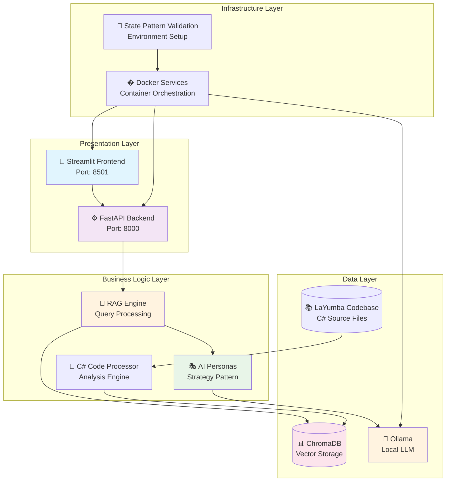
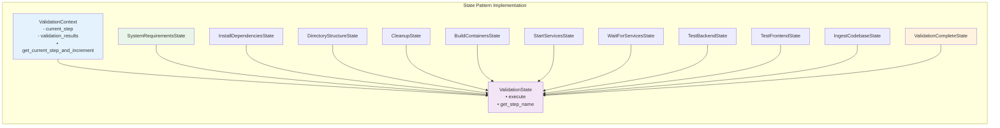
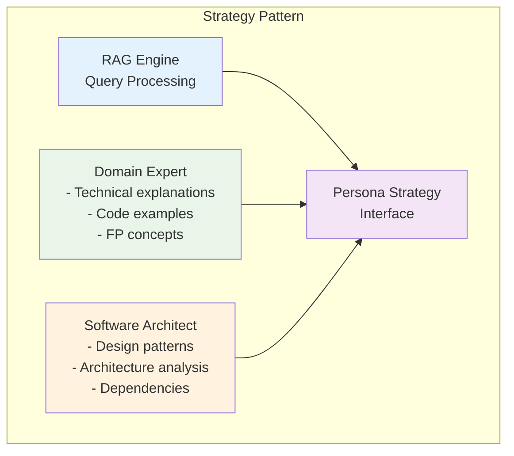
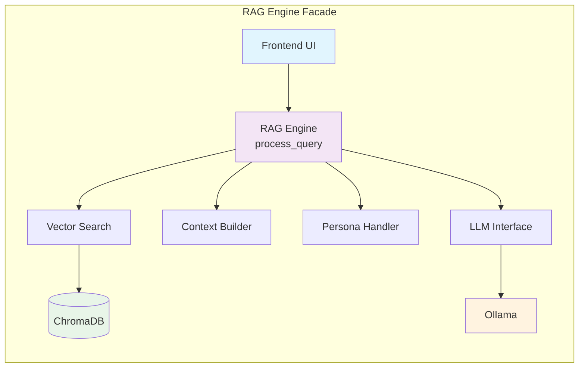
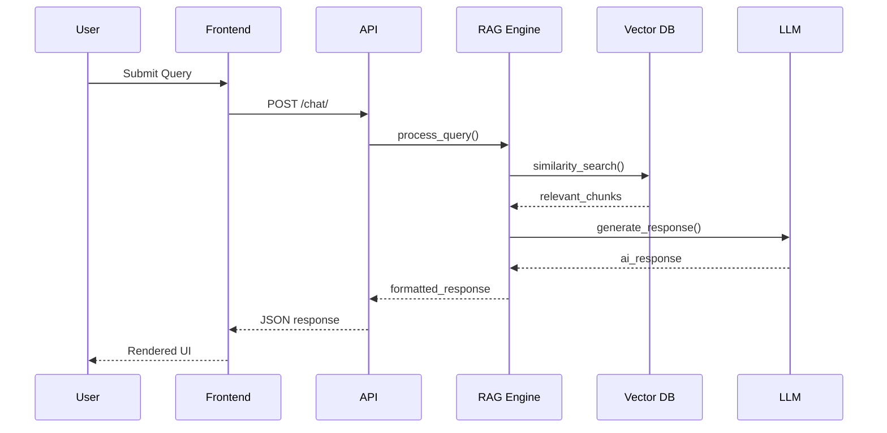
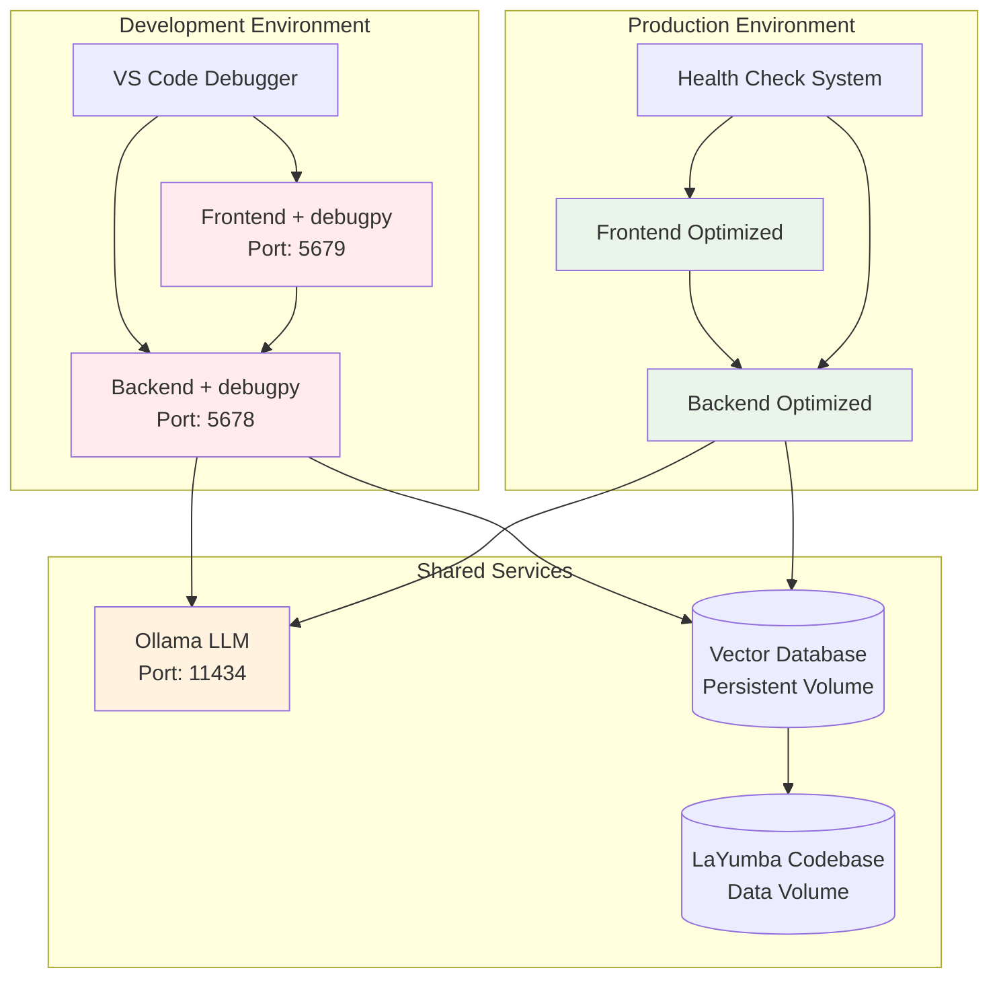
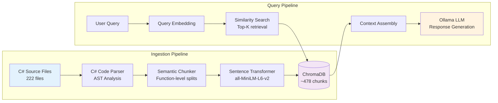
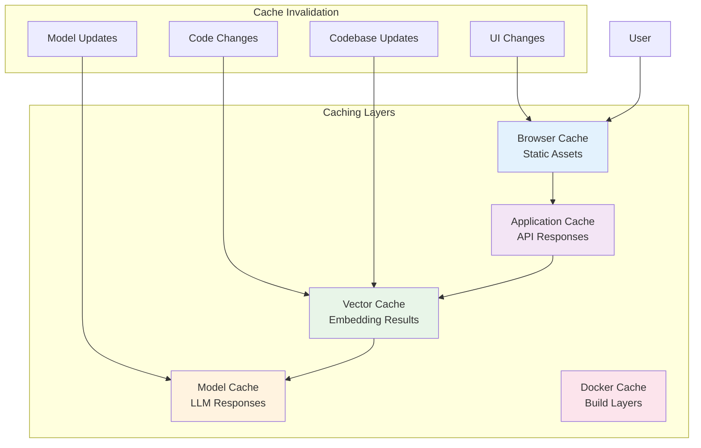
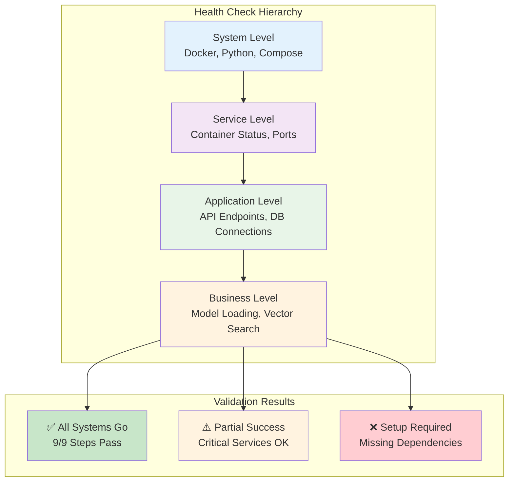
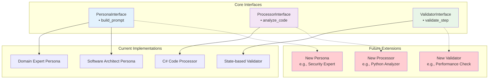

# 🏗️ Technical Architecture

## 🎯 Architecture Overview

The RAG Chatbot project implements a modern microservices architecture using the **State Pattern** for validation orchestration, **Repository Pattern** for data access, and **Strategy Pattern** for AI persona handling. The system is built with Docker-first principles, emphasizing separation of concerns, testability, and maintainability.

### Core Design Principles
- **Low Coupling**: Clear separation between presentation, coordination, and business logic
- **Information Expert**: Knowledge stays with the classes that have it
- **Single Responsibility**: Each component has one clear purpose
- **Dependency Inversion**: High-level modules don't depend on low-level modules

## 🏗️ System Architecture

### High-Level System Design



## 📂 Technical Project Structure

The project follows a **layered architecture** with clear separation between presentation, business logic, data access, and infrastructure concerns:

```
src/
├── 📁 backend/                     # FastAPI Microservice
│   ├── 📁 api/                     # REST API Layer
│   │   ├── main.py                 # FastAPI application factory
│   │   └── routes.py               # HTTP endpoint definitions
│   ├── 📁 chat/                    # Business Logic Layer
│   │   ├── rag_engine.py           # RAG orchestration (Facade pattern)
│   │   └── personas.py             # AI persona strategies
│   ├── 📁 core/                    # Domain Layer
│   │   ├── config.py               # Configuration management
│   │   └── models.py               # Domain models (Pydantic)
│   └── 📁 ingestion/               # Data Access Layer
│       ├── csharp_processor.py     # Code analysis engine
│       ├── embeddings.py           # Vector embedding service
│       └── database.py             # Repository pattern implementation
├── 📁 frontend/                    # Streamlit Microservice
│   └── 📁 ui/                      # Presentation Layer
│       ├── streamlit_app.py        # Main application controller
│       ├── components.py           # Reusable UI components
│       ├── models.py               # UI data models
│       └── styles.py               # Presentation styling
└── 📁 scripts/                     # Infrastructure Layer
    ├── setup_environment.py        # State machine orchestrator
    └── 📁 validation_states/        # State pattern implementation
        ├── base.py                 # Abstract state interface
        ├── context.py              # Shared state management
        ├── state_machine.py        # State transition controller
        └── *_state.py              # Concrete state implementations
```

## 🎭 Design Patterns Implementation

### 1. State Pattern - Validation Orchestration

The environment validation system implements the **Gang of Four State Pattern** for managing complex deployment workflows with 10 automated validation steps:

1. **System Requirements** - Python, Docker, Docker Compose availability
2. **Install Dependencies** - Automatic Python package installation (docker, GitPython, psutil, pyyaml, etc.)
3. **Directory Structure** - Project layout verification
4. **Cleanup** - Previous deployment cleanup
5. **Build Containers** - Docker image building with GPU support
6. **Start Services** - Service orchestration with GPU acceleration
7. **Wait for Services** - Health check polling
8. **Test Backend** - API functionality validation
9. **Test Frontend** - UI accessibility verification
10. **Ingest Codebase** - Vector database population

The validation process is fully automated and handles fresh machine deployments:



**Key Benefits:**
- **Eliminates Magic Numbers**: Dynamic step numbering managed by `ValidationContext`
- **Low Coupling**: State classes focus on coordination, business logic classes handle execution
- **Extensibility**: Easy to add new validation steps without breaking existing workflow

### 2. Strategy Pattern - AI Personas

The chat system uses the **Strategy Pattern** to handle different AI personas with distinct behavior:



### 3. Repository Pattern - Data Access

Vector database operations follow the **Repository Pattern** for clean data access abstraction:

```python
class VectorDatabase:
    """Repository pattern implementation for vector operations"""
    
    def add_documents(self, documents: List[Document]) -> None:
        """Abstract document storage"""
        
    def similarity_search(self, query: str, k: int = 4) -> List[Document]:
        """Abstract similarity search"""
        
    def is_empty(self) -> bool:
        """Abstract state checking"""
```

### 4. Facade Pattern - RAG Engine

The RAG Engine implements the **Facade Pattern** to simplify complex subsystem interactions:



## �️ Technology Stack & Implementation

### Core Technologies

| Layer | Technology | Purpose | Design Pattern |
|-------|------------|---------|----------------|
| **Frontend** | Streamlit | Interactive UI | MVC (Model-View-Controller) |
| **Backend** | FastAPI | REST API | Layered Architecture |
| **Database** | ChromaDB | Vector Storage | Repository Pattern |
| **LLM** | Ollama | Local Inference | Adapter Pattern |
| **Validation** | Custom Framework | Environment Setup | State Pattern |
| **Containerization** | Docker | Service Isolation | Microservices |

### Data Flow Architecture



### Configuration Management

The system uses **environment-based configuration** with hierarchical precedence:

```python
# backend/core/config.py
class Settings(BaseSettings):
    # Database configuration
    vector_db_path: str = Field(default="./data/vector_db")
    
    # LLM configuration  
    ollama_url: str = Field(default="http://ollama:11434")
    ollama_model: str = Field(default="llama3.2:3b")
    
    # API configuration
    cors_origins: List[str] = Field(default=["http://localhost:8501"])
    
    class Config:
        env_file = ".env"  # Override with environment variables
```

**Configuration Hierarchy:**
1. Environment variables (highest priority)
2. `.env` file values
3. Default values in code (lowest priority)

## � Container Architecture & Optimization

### Multi-Stage Docker Strategy

The project implements **optimized multi-stage Docker builds** for development efficiency:

```dockerfile
# Backend Dockerfile pattern
FROM python:3.10-slim AS base
# System dependencies and security updates

FROM base AS dependencies
# Heavy AI/ML dependencies (cached layer)
COPY requirements.txt .
RUN pip install --no-cache-dir -r requirements.txt

FROM dependencies AS development
# Development tools (debugpy, hot reload)
ENV ENVIRONMENT=development

FROM dependencies AS production
# Optimized for production deployment
ENV ENVIRONMENT=production
```

### Service Dependency Optimization

| Service | Dependencies | Build Time | Strategy |
|---------|-------------|------------|----------|
| **Frontend** | 3 packages | ~29 seconds | Minimal deps |
| **Backend** | 15+ packages | ~6 minutes | Layer caching |
| **Ollama** | Pre-built image | Download only | No build |

### GPU Acceleration Architecture

The system supports **NVIDIA GPU acceleration** for both LLM inference and embedding generation:

```yaml
# docker-compose.yml GPU configuration
services:
  ollama:
    deploy:
      resources:
        reservations:
          devices:
            - driver: nvidia
              count: all
              capabilities: [gpu]
    environment:
      - OLLAMA_KEEP_ALIVE=24h  # Keep model loaded in GPU memory
  
  backend:
    deploy:
      resources:
        reservations:
          devices:
            - driver: nvidia
              count: all
              capabilities: [gpu]
    environment:
      - CUDA_VISIBLE_DEVICES=0
      - TORCH_CUDA_ARCH_LIST=6.0;6.1;7.0;7.5;8.0;8.6;9.0
```

**Performance Impact:**
- **First request**: ~50-60 seconds (model loading + inference)
- **Subsequent requests**: ~10-15 seconds (inference only)
- **Model persistence**: 24-hour keep-alive prevents cold starts
- **Embedding acceleration**: GPU-accelerated sentence transformers

### Infrastructure Patterns



## 🧠 RAG (Retrieval-Augmented Generation) Implementation

### Vector Embedding Strategy

The system implements a **semantic code search** approach for the LaYumba functional programming codebase:



### Code Analysis Engine

The C# processor implements **functional programming pattern detection**:

```python
class CSharpProcessor:
    """Analyzes C# code for functional programming patterns"""
    
    def extract_functional_patterns(self, code: str) -> Dict[str, Any]:
        """Detect FP patterns in C# code"""
        patterns = {
            'option_usage': self._find_option_patterns(code),
            'either_usage': self._find_either_patterns(code), 
            'higher_order_functions': self._find_hof_patterns(code),
            'immutable_structures': self._find_immutable_patterns(code),
            'monadic_composition': self._find_monadic_patterns(code)
        }
        return patterns
```

### Persona-Based Response Generation

The system uses **contextual prompt engineering** based on selected persona:

| Persona | Focus | Prompt Strategy | Example Query |
|---------|-------|-----------------|---------------|
| **Domain Expert** | Technical concepts | Code examples + explanations | "How does Option.Map work?" |
| **Software Architect** | Design patterns | Architecture analysis + dependencies | "Analyze the library structure" |

### Vector Search Optimization

```python
# Optimized similarity search with metadata filtering
def enhanced_search(self, query: str, persona: PersonaMode) -> List[Document]:
    """Context-aware vector search"""
    # Embed query
    query_vector = self.embeddings.embed_query(query)
    
    # Persona-specific metadata filters
    filters = self._get_persona_filters(persona)
    
    # Semantic search with filtering
    results = self.collection.query(
        query_embeddings=[query_vector],
        n_results=4,
        where=filters  # Filter by persona-relevant patterns
    )
    
    return self._rank_by_relevance(results)
```

## ⚡ Performance & Scalability Architecture

### Caching Strategy

The system implements **multi-level caching** for optimal performance:



### Resource Optimization

| Component | Resource Strategy | Performance Impact |
|-----------|------------------|-------------------| 
| **Vector DB** | Lazy loading + indexing | Sub-second search |
| **LLM Inference** | Local deployment | No API latency |
| **Container Builds** | Layer caching | 85% faster rebuilds |
| **Code Processing** | Batch ingestion | One-time setup cost |

### Memory Management

```python
class OptimizedEmbeddings:
    """Memory-efficient embedding management"""
    
    def __init__(self):
        self._model = None  # Lazy loading
        self._cache = LRUCache(maxsize=1000)
    
    @property
    def model(self):
        """Load model only when needed"""
        if self._model is None:
            self._model = SentenceTransformer('all-MiniLM-L6-v2')
        return self._model
    
    @lru_cache(maxsize=500)
    def embed_text(self, text: str) -> List[float]:
        """Cache embeddings to avoid recomputation"""
        return self.model.encode(text).tolist()
```

## 🔍 Monitoring & Quality Assurance

### Health Check Architecture

The system implements **comprehensive health monitoring** with cascading checks:



### Code Quality Patterns

The codebase follows **SOLID principles** and **Clean Architecture**:

```python
# Example: Dependency Inversion Principle
class RAGEngine:
    """High-level module depends on abstractions"""
    
    def __init__(
        self,
        vector_db: VectorDatabaseInterface,  # Abstract dependency
        llm_client: LLMInterface,           # Abstract dependency
        persona_handler: PersonaInterface   # Abstract dependency
    ):
        self._vector_db = vector_db
        self._llm_client = llm_client
        self._persona_handler = persona_handler
    
    def process_query(self, request: QueryRequest) -> QueryResponse:
        """Orchestrates query processing without knowing implementation details"""
        context = self._vector_db.search(request.query)
        prompt = self._persona_handler.build_prompt(request.persona, context)
        response = self._llm_client.generate(prompt)
        return QueryResponse(answer=response)
```

### Error Handling Strategy

```python
# Functional error handling patterns
from typing import Union, Optional
from dataclasses import dataclass

@dataclass
class Success:
    value: Any

@dataclass  
class Failure:
    error: str
    
Result = Union[Success, Failure]

def safe_vector_search(query: str) -> Result:
    """Railway-oriented programming for error handling"""
    try:
        results = vector_db.search(query)
        return Success(results)
    except Exception as e:
        return Failure(f"Vector search failed: {str(e)}")
```

## 🎯 Extension Architecture

### Plugin-Style Extensibility

The system is designed for **easy extension** following the **Open/Closed Principle**:



### Configuration-Driven Architecture

```python
# Example: Adding new personas via configuration
class PersonaConfig:
    """Configuration-driven persona management"""
    
    PERSONAS = {
        'domain_expert': {
            'name': 'Domain Expert',
            'prompt_template': 'domain_expert_template.txt',
            'focus_areas': ['concepts', 'examples', 'patterns']
        },
        'architect': {
            'name': 'Software Architect', 
            'prompt_template': 'architect_template.txt',
            'focus_areas': ['structure', 'dependencies', 'design']
        }
        # Easy to add new personas here
    }
```

### Microservice Extension Points

| Extension Point | Interface | Use Case |
|----------------|-----------|----------|
| **New Personas** | `PersonaInterface` | Add Security Analyst, Performance Expert |
| **New Languages** | `ProcessorInterface` | Support Python, Java, TypeScript analysis |
| **New Models** | `LLMInterface` | Support OpenAI, Anthropic, local models |
| **New Validators** | `ValidatorInterface` | Add security checks, performance tests |
| **New Databases** | `VectorDBInterface` | Support Pinecone, Weaviate, Qdrant |

## 🔗 Integration with Project Documentation

This architecture document focuses on the **technical implementation details**. For comprehensive project information, refer to:

- **[README.md](../README.md)** - Project overview, quick start guide, and setup instructions
- **[HACKATHON_GUIDE.md](HACKATHON_GUIDE.md)** - Development workflow, debugging setup, and challenge navigation
- **[DEBUG_GUIDE.md](DEBUG_GUIDE.md)** - Advanced VS Code debugging techniques and troubleshooting

## 📋 Architecture Summary

### Key Technical Achievements

1. **🎭 Design Patterns**: State, Strategy, Repository, and Facade patterns implemented
2. **🐳 Container Optimization**: Multi-stage builds with efficient layer caching
3. **🧠 RAG Implementation**: Semantic code search with functional programming pattern detection
4. **⚡ Performance**: Multi-level caching and lazy loading strategies
5. **🔍 Quality Assurance**: SOLID principles with comprehensive health monitoring
6. **🎯 Extensibility**: Plugin-style architecture with clear interfaces

### Technology Stack Summary

| Layer | Technology | Pattern | Benefits |
|-------|------------|---------|----------|
| **Frontend** | Streamlit | MVC | Rapid UI development |
| **Backend** | FastAPI | Layered Architecture | High performance APIs |
| **Database** | ChromaDB | Repository | Semantic code search |
| **LLM** | Ollama | Adapter | Local, private AI |
| **Validation** | State Pattern | Gang of Four | Complex workflow management |
| **Infrastructure** | Docker | Microservices | Service isolation & scalability |

### Architectural Principles Applied

- **Low Coupling**: Clear separation between layers and concerns
- **High Cohesion**: Related functionality grouped together  
- **Single Responsibility**: Each component has one clear purpose
- **Open/Closed**: Easy to extend without modifying existing code
- **Dependency Inversion**: High-level modules independent of low-level details

This architecture provides a **production-ready foundation** for AI-powered code analysis while maintaining the **flexibility needed for rapid hackathon development**.